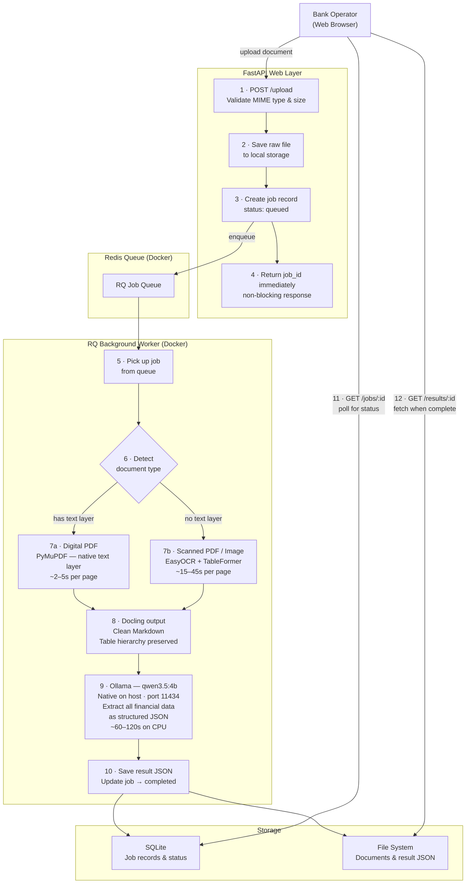

# Extraction Tool — Architecture

```mermaid
flowchart TD
    Operator["Bank Operator\n(Web Browser)"]

    subgraph API ["FastAPI Web Layer"]
        Upload["1 · POST /upload\nValidate MIME type & size"]
        SaveFile["2 · Save raw file\nto local storage"]
        CreateJob["3 · Create job record\nstatus: queued"]
        ReturnId["4 · Return job_id immediately\nnon-blocking response"]
        Upload --> SaveFile --> CreateJob --> ReturnId
    end

    subgraph RedisQueue ["Redis Queue (Docker)"]
        Queue["RQ Job Queue"]
    end

    subgraph Worker ["RQ Background Worker (Docker)"]
        PickUp["5 · Pick up job\nfrom queue"]
        Detect{"6 · Detect\ndocument type"}
        Digital["7a · Digital PDF\nPyMuPDF — native text layer\n~2–5s per page"]
        Scanned["7b · Scanned PDF / Image\nEasyOCR + TableFormer\n~15–45s per page"]
        Markdown["8 · Docling output\nClean Markdown\nTable hierarchy preserved"]
        LLM["9 · Ollama — qwen3.5:4b\nNative on host · port 11434\nExtract all financial data\nas structured JSON\n~60–120s on CPU"]
        Save["10 · Save result JSON\nUpdate job → completed"]

        PickUp --> Detect
        Detect -->|has text layer| Digital --> Markdown
        Detect -->|no text layer| Scanned --> Markdown
        Markdown --> LLM --> Save
    end

    subgraph Storage ["Storage"]
        SQLite["SQLite\nJob records & status"]
        FileSystem["File System\nDocuments & result JSON"]
    end

    Operator -->|upload document| Upload
    CreateJob -->|enqueue| Queue
    Queue --> PickUp
    Save --> SQLite
    Save --> FileSystem

    Operator -->|"11 · GET /jobs/:id\npoll for status"| SQLite
    Operator -->|"12 · GET /results/:id\nfetch when complete"| FileSystem
```
