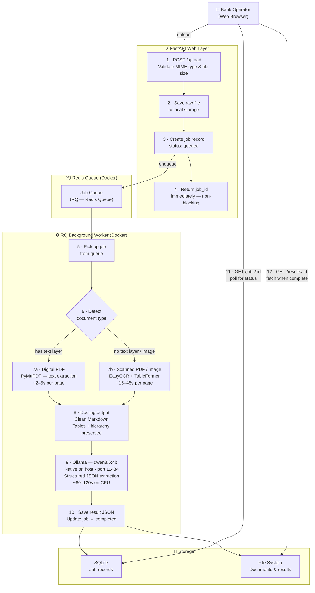

# Financial Document Extraction Tool — Implementation Plan

## Context

Bank operations teams need to extract structured data from client-submitted financial documents (balance sheets, income statements, cash flow statements) in digital PDF, scanned PDF, and image formats. Goal: upload a document, get structured JSON with all financial data extracted.

**Constraints:** no paid APIs, open source only, runs on CPU, simple but scalable.

---

## Architecture Diagram



---

## Infrastructure Requirements

**Does not require heavy infrastructure.** Runs on a standard laptop or small cloud VM.

| Spec | Minimum | Recommended |
|------|---------|-------------|
| RAM | 8 GB | 16 GB |
| CPU | 4 cores | 8 cores |
| Disk | 10 GB free | 20 GB free |
| GPU | Not required | Optional — Ollama uses it automatically if present |

**On CPU, per document (3-5 pages):**
- Digital PDF: ~1–3 minutes
- Scanned PDF / image: ~3–7 minutes

**Model installed:** `qwen3.5:4b` (~3.4 GB on disk, ~2.5 GB RAM at runtime when loaded by Ollama)

---

## Stack

| Component | Choice | Why |
|-----------|--------|-----|
| Document parser | **Docling (IBM open source)** | TableFormer preserves nested table hierarchy — critical for balance sheets |
| LLM | **Ollama + qwen3.5:4b** | Local, free, no data leaves the machine, strong JSON generation |
| API | **Python FastAPI** | Python ecosystem required for Docling + Ollama |
| Task queue | **RQ (Redis Queue)** | Simple, scales by adding worker processes |
| Database | **SQLite** (MVP) | Zero setup; swap to PostgreSQL later with no other changes |
| Containers | **Docker Compose** | Runs api, worker, redis — Ollama stays native on host, called via `host.docker.internal:11434` |
| UI | **React + Vite** | Simple upload → status → result flow, served as static files from FastAPI |

**Why not:**
- Cloud Document AI (Textract, Google DocAI, Azure) — paid + sends sensitive client data to third-party servers
- Pure OCR + rules — breaks on every new document layout variant
- Custom ML training — needs labeled data, GPU training infrastructure, months of iteration
- Cloud LLMs (OpenAI, Claude API) — paid + same data sovereignty problem

---

## Folder Structure

```
financial-extractor/
├── pyproject.toml
├── .env.example
├── app/
│   ├── main.py                   # FastAPI app + lifespan
│   ├── config.py                 # Settings from env vars
│   ├── api/
│   │   ├── upload.py             # POST /upload
│   │   ├── jobs.py               # GET /jobs/{id}
│   │   └── results.py            # GET /results/{id}
│   ├── pipeline/
│   │   ├── detector.py           # Digital vs scanned detection
│   │   ├── docling_processor.py  # PDF/image → Markdown
│   │   └── ollama_extractor.py   # Markdown → structured JSON
│   ├── queue/
│   │   ├── worker.py             # RQ task orchestration
│   │   └── job_store.py          # Job CRUD (SQLite)
│   ├── storage/
│   │   ├── file_store.py         # Local disk (S3-swappable)
│   │   └── paths.py
│   └── models/
│       └── job.py                # Pydantic schemas
├── prompts/
│   └── financial_extraction.txt  # LLM prompt — editable without code changes
├── ui/                           # React + Vite frontend (Phase 7)
├── tests/
│   ├── fixtures/
│   ├── unit/
│   └── integration/
└── docker/
    ├── Dockerfile
    ├── docker-compose.yml
    └── .dockerignore
```

---

## LLM Prompt Strategy

No predefined schema — the LLM discovers the document's own structure:

```
You are a financial document data extractor.

The following is a financial document converted to Markdown.
Extract ALL financial data as a structured JSON object.

Rules:
- Preserve the document's own section/subsection hierarchy
- Capture every line item and all column values (including prior-year columns)
- Include metadata: company name, document type, reporting period, currency
- Use null for missing or illegible values — never invent values
- Return ONLY valid JSON with no explanation

Document:
{markdown_content}
```

> **Implementation note:** `{markdown_content}` is a placeholder. In code this is a Python f-string or `.format()` call — not a literal brace. The prompt is stored in `prompts/financial_extraction.txt` and loaded at runtime with the actual Markdown substituted in.

---

## Scalability Path

- **More throughput:** Add RQ worker processes — no code changes
- **Faster inference:** Add GPU — Ollama detects and uses it automatically
- **Better model:** Change `OLLAMA_MODEL` env var — no code changes
- **Cloud storage:** Swap `file_store.py` only

---

## Verification

1. `docker compose up` — all 4 services start cleanly
2. Upload a digital PDF balance sheet → job completes, JSON has company name, period, all line items
3. Upload a scanned PDF → OCR path taken, same verification
4. Upload a JPG image → same
5. Upload a corrupt file → clean error, no crash
6. Upload 5 documents simultaneously → all complete, no queue corruption
7. Manually compare extracted JSONs against source documents
